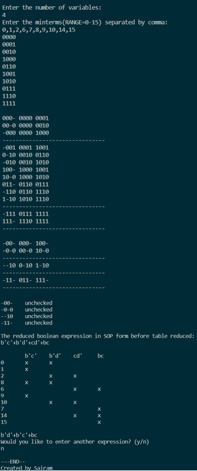

# Boolean Minimization
Simplifying boolean function is one of the basics in digital electronics. Quinine McClunskey also known as tabulation method helps to minimize booleans with large number of variables, where the number of variables acts as a limitation in K-map. This method helps in simplifying. 

## Output

